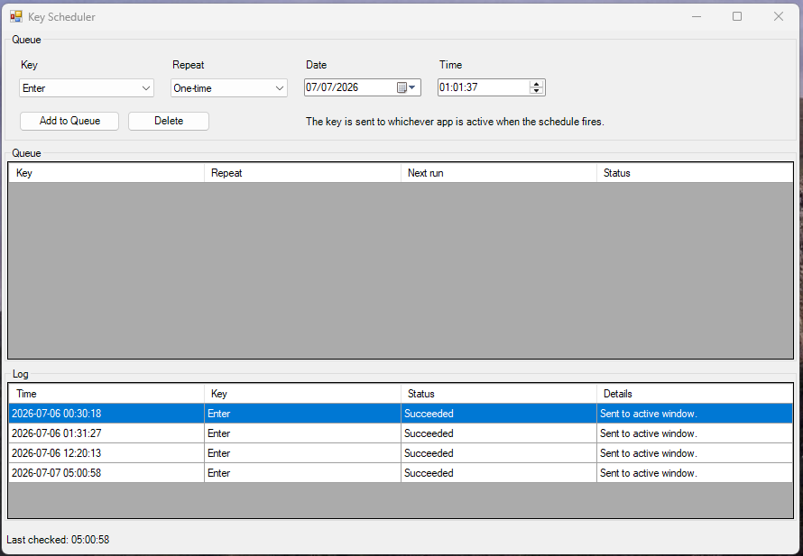

# Key Scheduler

A small Windows desktop utility for scheduling a keystroke to be sent to the app that is active when the schedule fires.



## Run

Portable executable:

```text
dist\KeyScheduler.exe
```

From PowerShell:

```powershell
powershell.exe -ExecutionPolicy Bypass -File .\KeyScheduler.ps1
```

The app must remain running while schedules are active.

## Build The Executable

```powershell
C:\Windows\Microsoft.NET\Framework64\v4.0.30319\csc.exe /nologo /target:winexe /out:.\dist\KeyScheduler.exe /resource:.\KeyScheduler.ps1,KeyScheduler.ps1 .\KeySchedulerLauncher.cs
```

The executable embeds `KeyScheduler.ps1` and launches it with Windows PowerShell.

## Features

- Schedule a one-time, daily, or weekly keystroke.
- Send common keys such as Enter, Escape, Tab, Space, arrow keys, F1-F12, and simple Ctrl combinations.
- View pending schedules and recent run results.
- Edit, disable, or delete schedules.
- Persist schedules locally across restarts.

## Behavior

The keystroke is sent to whichever application has focus at the scheduled time. Version 1 does not target background windows or remember which app was active when the schedule was created.

If a schedule is more than 60 seconds late, it is marked as missed instead of firing late.

## Data Location

Schedules and recent run history are stored under:

```text
%LOCALAPPDATA%\KeyScheduler
```
